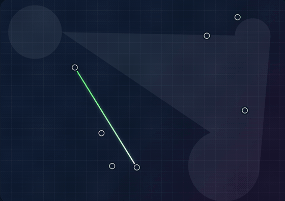

# Triangle Trap

  

A polished browser strategy game where players draw lines, close triangles, and outsmart each other on a dynamic geometric board.

## How It Works

- Players take turns connecting two points with a legal line.
- A line cannot cross existing lines or pass too close to another point.
- Closing a triangle earns a point.
- When a player closes a triangle, they get another turn.
- The game ends when no more legal moves remain.

## Features

- Clean landing screen and focused game board
- Human and AI players
- Avatar selection for each player
- Live scoreboard and turn status
- Multiple board layouts

## Run Locally

Run `npm start` and open `http://localhost:3000`.

## Tech

- Vanilla JavaScript modules
- HTML5 canvas
- Lightweight Node.js static server
