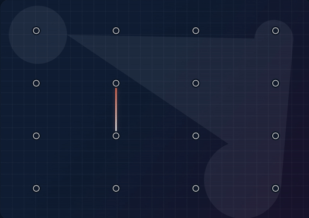

# Triangle Trap

  <table>
    <tr>
      <td align="center">
        <strong>Triangles Mode</strong> 
        
      </td>
      <td align="center">
        <strong>Rectangles Mode</strong> 
        
      </td>
    </tr>
  </table>

A polished browser strategy game where players draw lines, close shapes, race the turn timer, and outsmart each other on dynamic geometric boards.

## How It Works

- `Triangles` mode: connect any legal pair of points, avoid crossings, and close triangles.
- `Rectangles` mode: play on a grid, connect neighboring points, and close boxes for points.
- Closing a shape earns a point and grants another turn.
- Optional move timer of `5` or `10` seconds per turn.
- If a player's timer expires, they lose `1` point and the turn passes on, including into negative scores.
- The game ends when no more legal moves remain.

## Features

- Two-step setup flow: board first, players second
- Two scoring modes: `triangles` and `rectangles`
- Rectangle grid size selection for box-closing matches
- Triangle board layouts and point-count customization
- Human and AI players in the same match
- Per-AI difficulty selection: `easy`, `medium`, `hard`
- Per-match move timer selection: `off`, `5s`, `10s`
- Timeout penalty with negative-score support
- Avatar selection, live scoreboard, turn status, and in-game timer display

## Run Locally

Run `npm start` and open `http://localhost:3000`.
